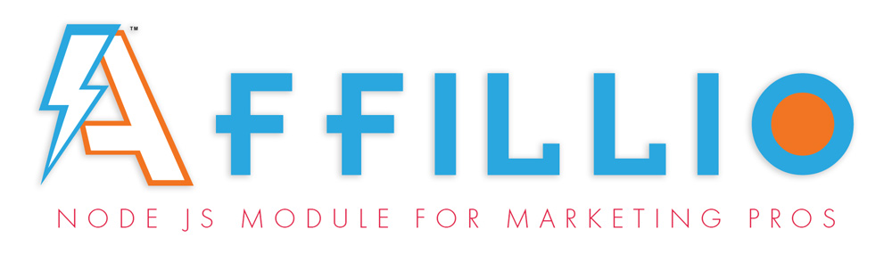

# AfloCommerce - [MEAN] Mongo + Express + Angular4 + NodeJS

## eCommerce portal tailored for developing with Angular4 + Affillio module
- Manage your affiliate partners
- hunt in partner catalog sources and social media of related experts 
- Manage 'Suggested Goods' derived from partner's catalogs
- Keep track of 'Suggested Goods' after approval into local shop for sale
- Benefit from blazing speed and highly scalable NodeJS + TypeScript

## Quick start
> Make sure you have **Node** version >= 8.0, **NPM** >= 5 and **MongoDB**

> Start mongodb in a separate shell

In Windows operating system we can start it by opening the following file

```bash
C:/Program Files/MongoDB/Server/3.2/bin/mongod.exe
```

```bash
# navigate inside the directory
cd aflocom

# install the dependencies with npm
npm i

# Start the server and client
npm start
```
go to [http://0.0.0.0:4200](http://0.0.0.0:4200) or [http://localhost:4200](http://localhost:4200) in your browser

## Minor AfloCommerce Dev issues 
- Login Authorization requires a refresh after sign in.  A polished emitter will be added soon 
- needs to accomodate parent and child categories in the "Category" dropdown in shop

<p align="center">
  
</p>

# The Birth of the AfloHunter Class
The "hunter" can be seen like as the method man that carries out the tasks of:
- scraping Catalog Sources
- providing code pattern intel to Affillio Module
- managing the interpretation of incoming data for conversion to a Suggested Good
- classification and regression of scraped data for machine learning
- broadcasting hunter status


## COMING SOON! ##
Full encapsulation of [Affillio AI Module](https://github.com/MichaelLogic/AfloCommerce.git) - the modular affiliate "hunter"

Uploaded media storage with Amazon S3

